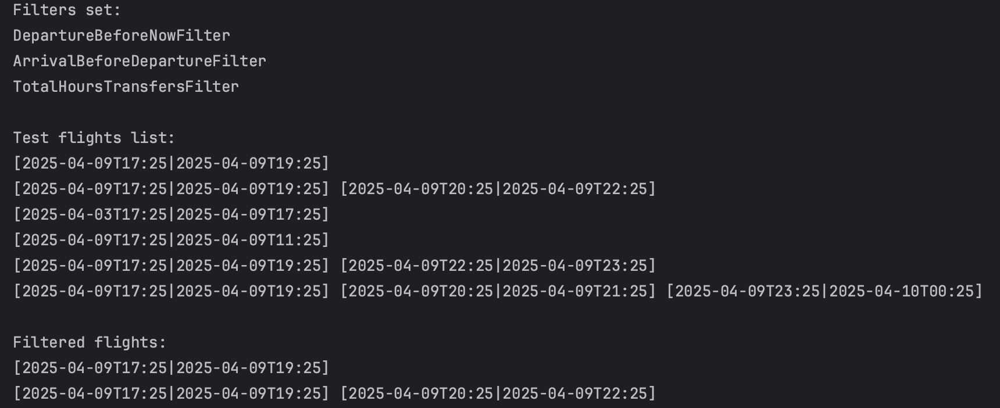
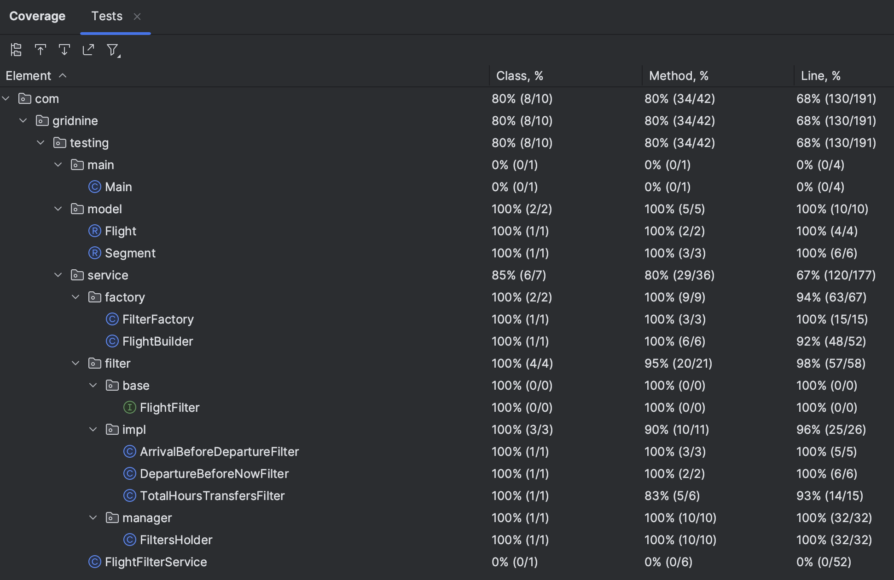

# FlightsFilter (Фильтр полетов)

## Содержание
1. [О проекте](#о-проекте)
2. [Особенности проекта](#особенности-проекта)
3. [Сборка](#сборка)

## О проекте

В этом небольшом проекте был реализован модуль, который занимается фильтрацией полетов. На вход из потока поступают данные в виде полетов (полет - это класс, который состоит из списка сегментов, которые в свою очередь включают в себя время отправления и время прибытия). Далее в менеджере фильтров добавляются и применяются необходимые нам фильтры, которые отсеивают не подходящие под условия полеты. В итоге мы получаем уже новый список полетов, который можно вывести в консоль.  

 ## Особенности проекта

Модуль фильтрации способен обрабатывать большие наборы полетов и динамически подключать/отключать необходимые для задачи фильтры. В качестве примера были созданы следующие 3 фильтра, совместная работа которых представлена на скриншоте ниже (запуск происходит через `Main-класс`):
1) Отбор полетов, отправление у которых происходит в будущем (полеты, вылет у которых уже состоялся, отсеиваются);
2) Исключение полетов, у которых время отправления позже времени прибытия (то есть эффект назад в прошлое, например, при неправильном вводе данных);
3) Время между всеми пересадками не превышает заданное количество часов (задается отдельным параметром). 

	

    
	
	*Вывод отфильтрованных полетов в консоль*
	

Представлены следующие паттерны проектирования:

1) Стратегия - имеется общий функциональный интерфейс `FlightFilter`, содержащий единственный метод filter, реализация которого представлена непосредственно в классах-фильтрах, имплементирующих данный интерфейс;
2) Фабричный метод - классы-фабрики (`FilterFactory` и `FlightBuilder`), которые скрывают от внешнего взора свои внутренние процессы по созданию объектов;
3) Синглтон - объект класса `FilterHolder` (содержит в себе все применяемые фильтры) возможен только в единственном экземпляре в модуле.

Использовался JUnit для покрытия модуль тестами. Код покрыт на 90% и выше:
   	

    
  	*Покрытие кода тестами*
  	

## Сборка

Проект собирается с помощью Gradle (Kotlin DSL), JDK 18. Ниже представлены команды, которые можно прописать в консоли в корне проекта:

| Команда                                          | Описание                                                                |
|--------------------------------------------------|-------------------------------------------------------------------------|
| `./gradlew run`                                  | Запускает приложение напрямую без сборки JAR-файла                      |
| `./gradlew jar`                                  | Создает исполняемый JAR `build/libs/flight-filter-1.0-all.jar`          |
| `./gradlew test`                                 | Запускает unit-тесты и генерирует отчет в HTML `build/reports/tests/test/index.html` |
| `./gradlew clean`                                | Очищает каталог сборки (`build/`), удаляя все сгенерированные файлы     |
| `java -jar build/libs/flight-filter-1.0-all.jar` | Запуск собранного JAR (Linux/macOS)                                     |
| `javaw -jar build/libs/flight-filter-1.0-all.jar`| Запуск JAR без консоли (Windows)                                        |

